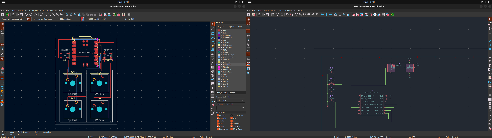

# May 21st: Created KiCad Project!
Just Created Project in KiCad and now starting to import components

**Total time spent: 10 Mins**

# May 21st: Created PCB & Schemetics for MacroPad V2
Designed Schemetic and PCB for the MacroPad V2 . Used DRC to check for any errors . 

**Total time spent: 3Hrs Mins**
