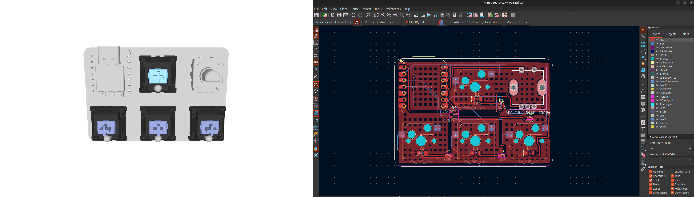

# May 21st: Created KiCad Project!
Just Created Project in KiCad and now starting to import components

**Total time spent: 10 Mins**

# May 21st: Created PCB & Schemetics for MacroPad V2
Designed Schemetic and PCB for the MacroPad V2 . Used DRC to check for any errors . 

**Total time spent: 3Hrs Mins**

# May 22st: Made changes in the schemetics , added rotary encoder , added support for hot swapable switch
Made major changes 
 1- Added Rotary encoder 
 2- Added Support for hot swapable switch
 3- Added Backlight ( static red)
 4- Added Copper fills
 5- Added 3d Models for the footprints

**Total time spent: 16Hrs**
